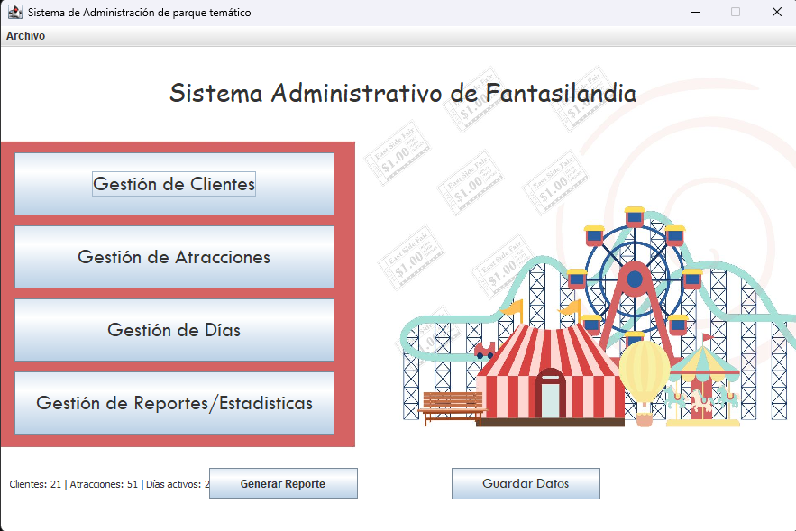
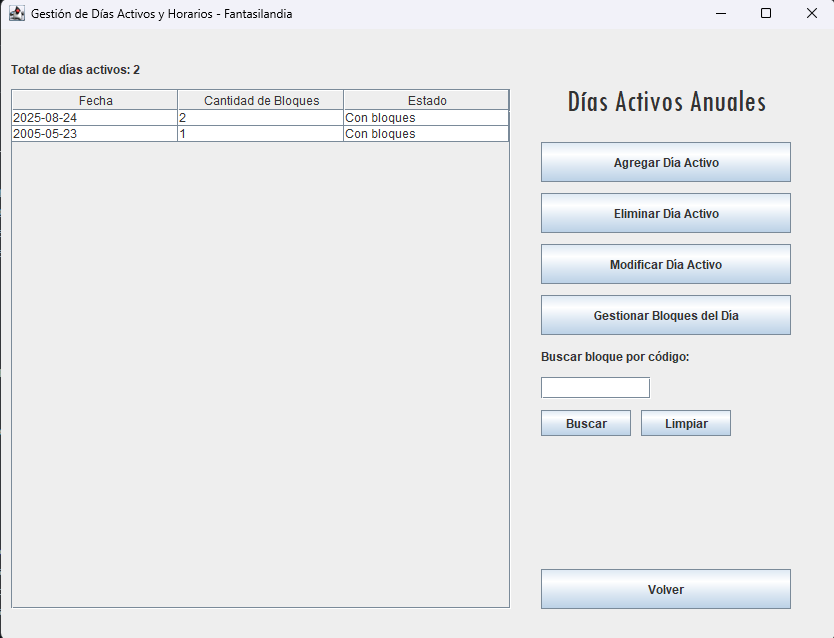
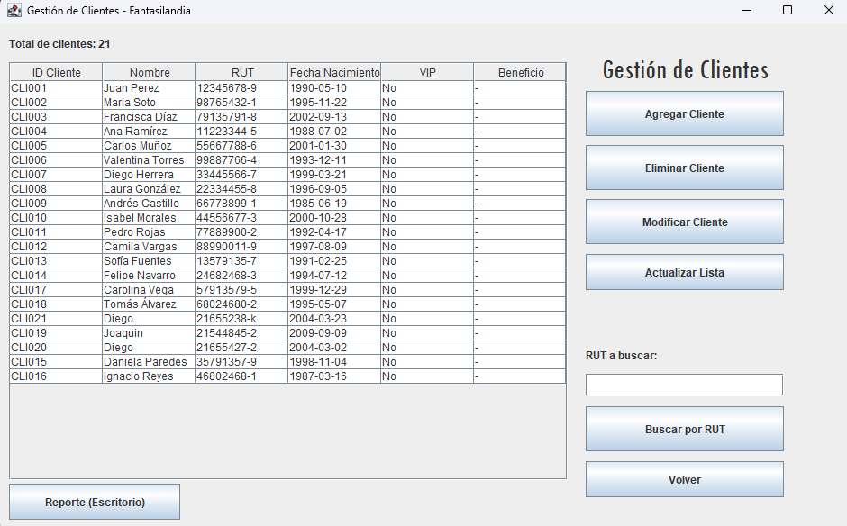
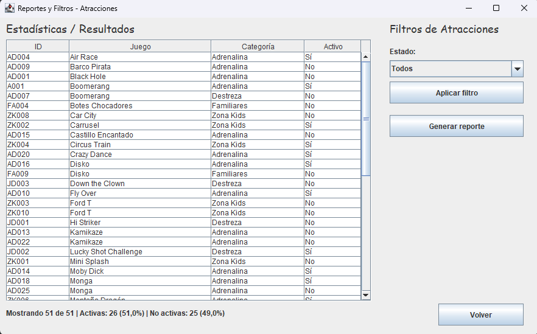

<div align="center">


<br/>


</div>

<br/>


### ▎DESCRIPCIÓN

**Fantasilandia 2.0** es un sistema de información de escritorio basico para gestionar un parque de atracciones. Desarrollado en Java (JDK 11) con interfaz gráfica **Java Swing**, aplicando principios de **Programación Orientada a Objetos**.

Permite administrar clientes, atracciones y bloques de horario, con persistencia de datos y filtrado avanzado.

<br/>


### ▎FUNCIONALIDADES DEL PROYECTO

- **Gestión de clientes y atracciones** — registro, edición y eliminación con validaciones.
- **Administración de bloques de horario** — inscripción de clientes a atracciones por tramos horarios.
- **Filtrado y búsqueda** — búsqueda de bloques por criterios específicos a través de una o más colecciones.
- **Persistencia de datos** — carga automática al iniciar y guardado al cerrar mediante archivos CSV/TXT.
- **Reportes** — generación de archivos de texto con el estado actual de las colecciones.
- **Interfaz gráfica completa** — todas las operaciones disponibles a través de ventanas Swing.

<br/>


### ▎TECNOLOGÍAS USADAS

| Tecnología | Uso |
|---|---|
|  | Lenguaje principal |
|  | Interfaz gráfica de escritorio |
|  | Listas, Maps y colecciones anidadas |
|  | Jerarquía de clases del dominio |
|  | Manejo de errores del negocio |
|  | Carga y guardado batch de datos |

<br/>


### ▎CAPTURAS DEL PROYECTO

| Menú principal | Gestión de atracciones |
|---|---|
|  |  |

| Bloques de horario | Gestión de clientes |
|---|---|
|  |  |

| Reportes y filtros | |
|---|---|
|  | |

<br/>


### ▎ESTRUCTURA

```
Fantasilandia4.0/
├── src/
│   ├── consola/         # Interacción por consola
│   ├── Excepciones/     # Clases de excepciones personalizadas
│   ├── fantasilandia/   # Clases del dominio (Cliente, Atraccion, BloqueDeAtraccion...)
│   ├── GUI/             # Ventanas Swing
│   ├── persistencia/    # Lógica de carga y guardado de datos
│   ├── resources/       # Recursos del proyecto
│   ├── screenshots/     # Capturas de pantalla
│   └── Main.java        # Punto de entrada
├── data/                # Archivos CSV/TXT de persistencia
├── bin/                 # Archivos compilados
└── README.md
```

<br/>


### ▎REQUISITOS

- **JDK 11** — [Descargar](https://www.oracle.com/java/technologies/javase/jdk11-archive-downloads.html)
- **IDE compatible**: IntelliJ IDEA, Eclipse o NetBeans

<br/>


### ▎EJECUCIÓN

**IntelliJ IDEA**
```
Build > Build Project  →  Run > Run 'Main'
```
**Eclipse**
```
Import > Existing Projects  →  Clic derecho Main.java > Run As > Java Application
```
**NetBeans**
```
Build Project (F11)  →  Run Project (F6)
```

<br/>


### ▎CONTEXTO ACADÉMICO 2025

Proyecto desarrollado para **INF2236 — Programación Avanzada** durante 2025 en la [Pontificia Universidad Católica de Valparaíso (PUCV)](https://www.pucv.cl), 4° semestre de Ingeniería en Informática.

Requisitos cubiertos: colecciones anidadas (JCF), sobrecarga y sobreescritura, excepciones personalizadas, persistencia batch, interfaz Swing, diagrama UML.

<br/>


### ▎AUTORES

<div align="center">

[](https://github.com/cord0990)
[](https://github.com/PatataSubnormal)
[](https://github.com/cortadew)

</div>

<br/>

